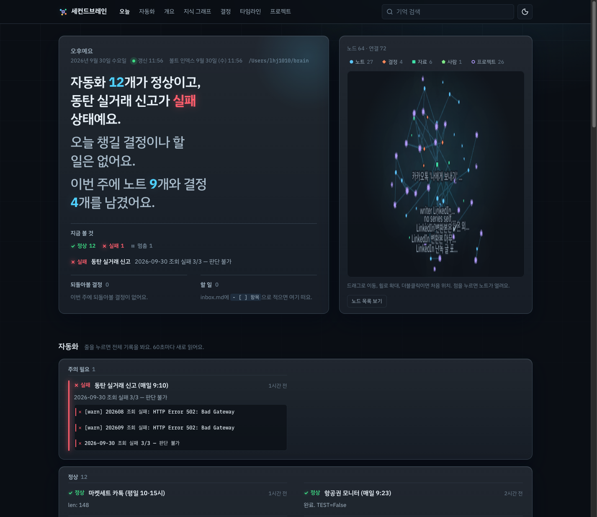
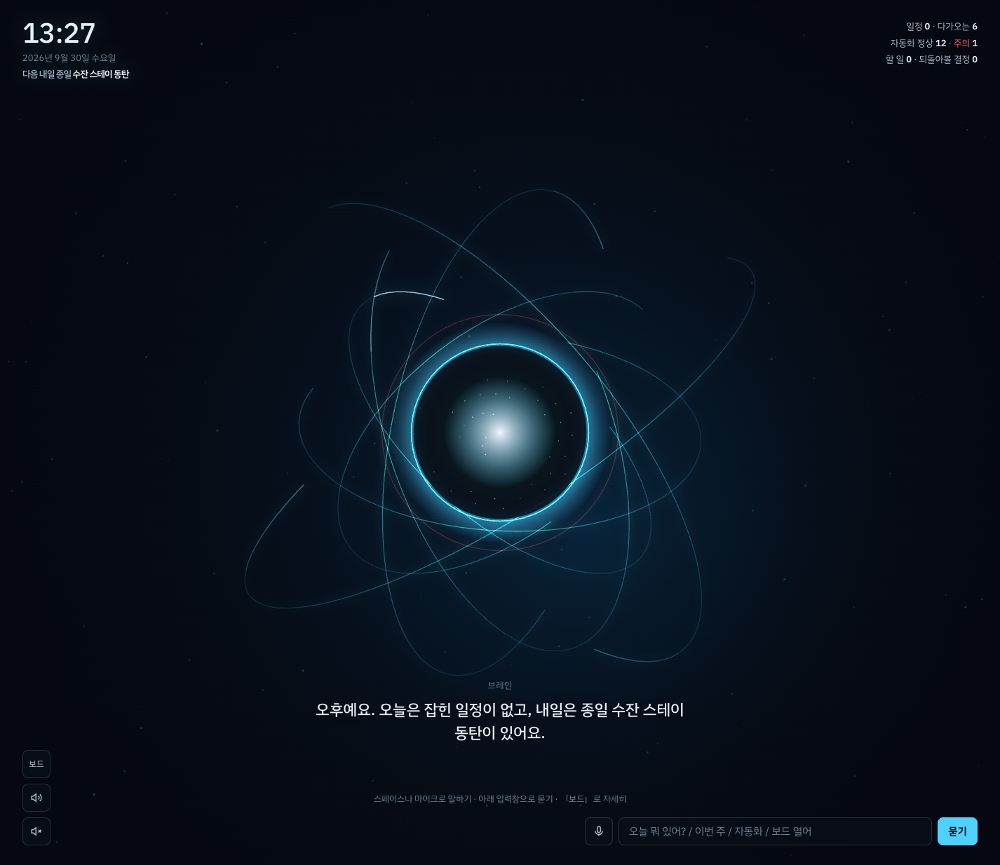
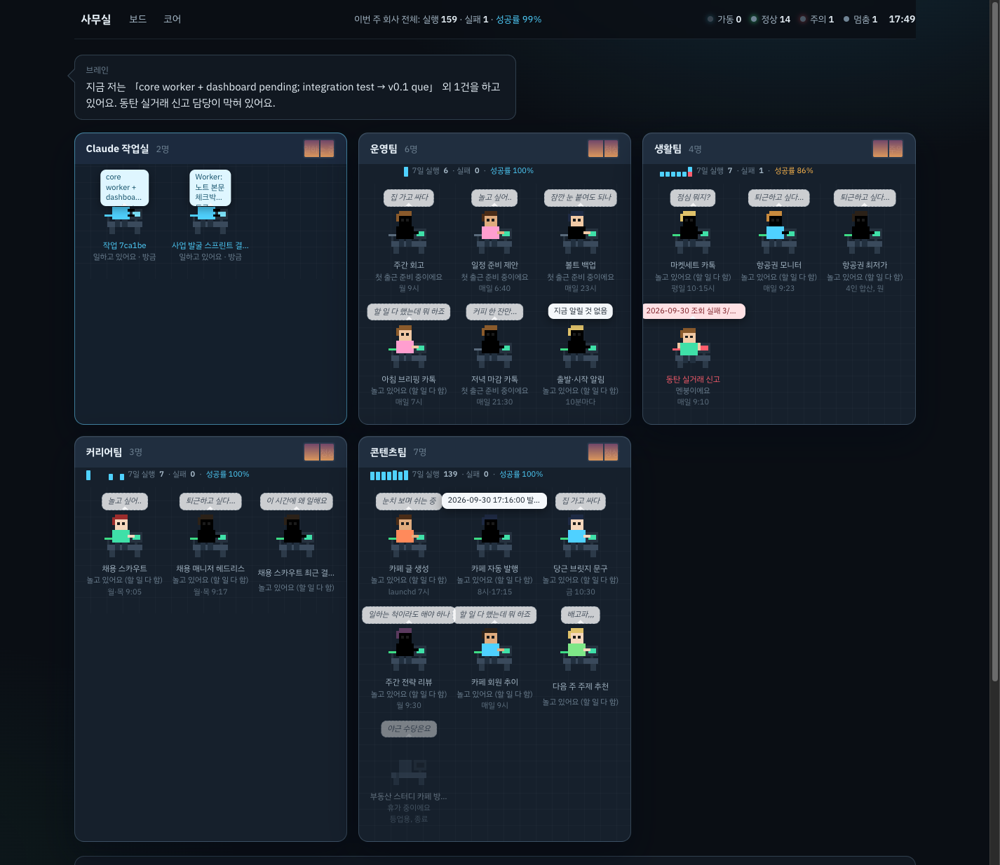
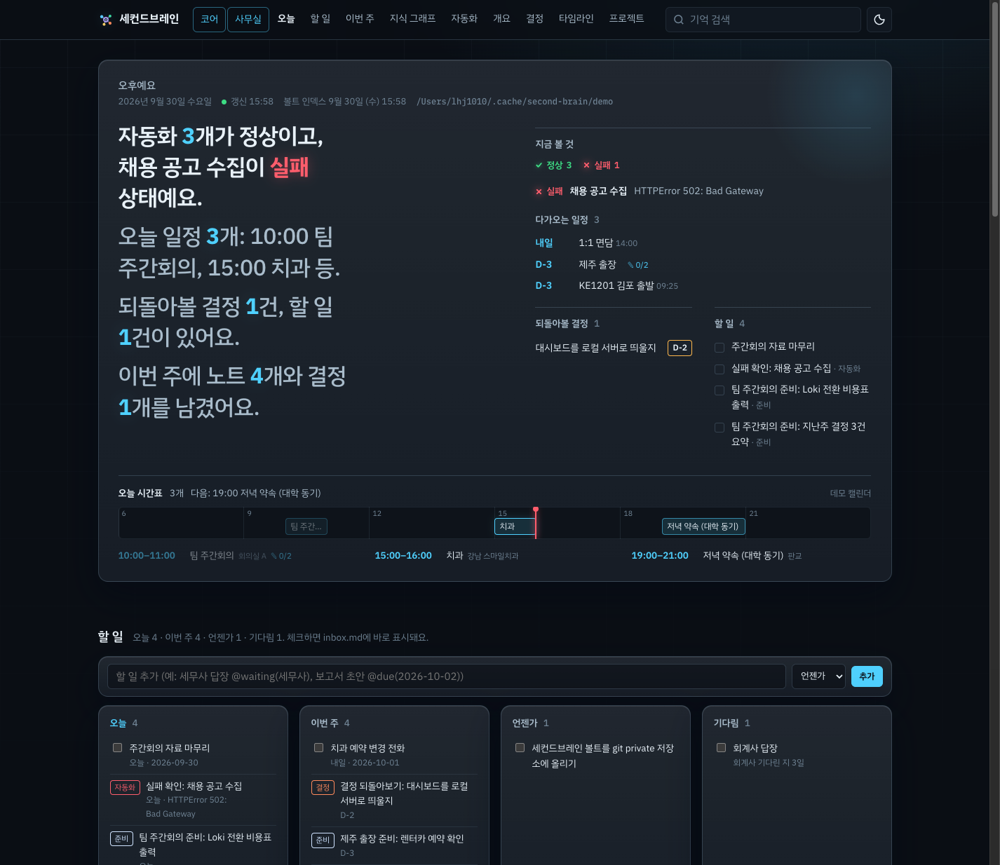
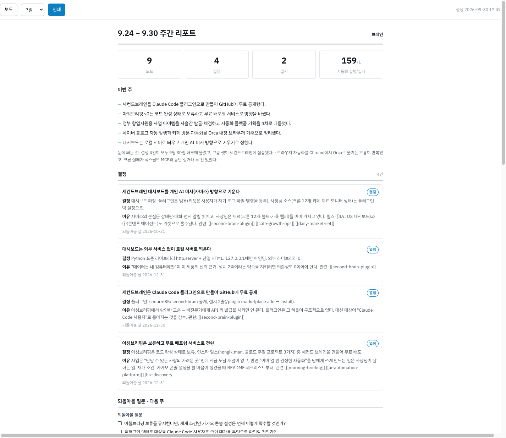

# 세컨드브레인 (second-brain)

한국어 · [English](README.en.md) · [](https://github.com/sedurm85/second-brain/actions/workflows/tests.yml)


> A Claude Code plugin that turns "remember this" into plain-markdown notes in a local vault, then grows into a living assistant: calendar, tasks, itineraries, a speaking "core" screen and a pixel office where your automations work as employees.
> No accounts, no API keys, no servers. Obsidian-compatible markdown on your own disk, a 127.0.0.1-only dashboard, standard library only.

**Claude와 대화하다 "기억해둬"라고 하면 쌓이고, "그때 왜 그렇게 정했지?"라고 물으면 결정의 이유까지 찾아주는 개인 지식 창고.** 여기에 캘린더·할 일·여행 동선·아침 브리핑·말하는 코어·직원 캐릭터 사무실을 얹어 **살아 움직이는 비서**로 키우고 있습니다.

## 30초 설치

Claude Code에서 두 줄이면 끝납니다.

```
/plugin marketplace add sedurm85/second-brain
/plugin install second-brain@second-brain
```

첫 "기억해둬" 때 볼트(`~/brain/`)를 만들지 한 번 묻습니다. 필요한 건 Python 3.9+ 하나(macOS·대부분의 Linux 기본 탑재)입니다.

## 화면 셋

| 보드 `/` | 코어 `/core` | 사무실 `/office` |
|---|---|---|
|  |  |  |
| 비서의 보고 문장, 오늘 시간표, 할 일 4열, 이번 주, 지식 그래프, 자동화, 결정·타임라인·프로젝트·사람 | 살아 있는 구체와 빛의 띠, 최소 HUD, 한국어 음성 브리핑, 마이크·입력창으로 묻기 | 자동화 하나가 직원 하나, 팀별 방, 가동 중이면 타이핑, 실패는 붉은 램프, Claude 배경 작업실 |

"대시보드 보여줘"(또는 `/second-brain:brain-view`) 한 번이면 `brain.py serve`가 내 컴퓨터에서만 서빙합니다. 외부 서비스·라이브러리 없이 HTML 파일 셋과 파이썬 하나입니다. `/report`는 인쇄용 주간 리포트 한 장입니다(아래 그림). 볼트가 없으면 `python3 scripts/brain.py serve --demo`로 가공 데이터 데모를 볼 수 있습니다. 데모는 실제 `~/.cache/second-brain` 캐시와 완전히 격리된 자기 캐시를 쓰며(오프라인), 오늘 일정 3개, 연체·기다림이 섞인 할 일 다섯 줄, 준비 체크리스트가 달린 회의, 장소(김포국제공항)와 동선 4단계·날씨 캐시가 붙은 출장, 자동화 4개(실패 1, 최근 7일 이력 포함), 대기 중인 제안 2건, 직원 요약과 코어 대화 기록까지 들어 있어 비서 기능을 그대로 만져 볼 수 있습니다.





## 비서가 하는 일

- **시간**: 구글 캘린더(비공개 ICS 주소 파일) 또는 맥 캘린더 앱(EventKit)을 읽어 오늘 시간표·이번 주·다가오는 일정을 보여주고, 보고 문장에 "오늘 일정 3개: 10:00 주간회의, 15:00 치과 등"처럼 넣습니다. 반복 일정·예외일·옮긴 회차·시간대를 처리하고 15분 캐시로 읽습니다. 장소가 있는(또는 "제주도"처럼 장소 이름인 종일) 일정은 날씨 요약이 함께 붙고, 내일 우산이 필요하면 카톡 브리핑에서 미리 알려줍니다.
- **일정 노트**: 일정을 누르면 상세 패널에서 메모·준비 체크리스트·동선(`14:00 집 출발 (자가용 50분)`)을 바로 씁니다. 볼트 `events/`에 마크다운으로 남고, 여러 날 여행은 노트 하나가 그 날짜들에 함께 붙습니다. 그날이 되면 시간표에 동선이 겹쳐 보입니다. 여러 날 이어지는 일정은 여행으로 인식해 항공편·숙소 같은 하위 일정을 묶고, 날짜별 탭과 날씨 기반 짐 목록을 제안합니다.
- **할 일**: `inbox.md`의 체크박스가 그대로 할 일입니다. `@due(2026-10-02)`, `@someday`, `@waiting(세무사)`, `@project(건강)` 문법으로 오늘·이번 주·언젠가·기다림 네 묶음이 되고, 결정 되돌아볼 날·자동화 실패·일정 준비 미완은 자동으로 들어옵니다. 저녁에 "남은 할 일 내일로"라고 하면 한 번에 옮깁니다.
- **먼저 말하기**: 카톡 헬퍼가 있으면 아침 7시 브리핑, 10분마다 출발·시작 알림(동선 10분 전, 일정 30분 전), 21:30 저녁 마감을 보냅니다(launchd 예시는 SPEC.md 참고). 카톡·macOS 알림이 없어도 보드·코어를 열어두면 같은 알림을 화면 안에서 직접 물어봐 토스트·음성으로 알려줍니다(중복 없이 한 번만).
- **미팅 준비**: 3일 안 일정마다 제목·참석자·장소로 내 기록을 검색해 관련 노트를 붙여 줍니다. 「준비할 일정」 카드에서 바로 열립니다. 참석자는 이름(존칭 제거)이나 이메일로 `people/` 노트와 자동 연결되어 매칭되면 바로 열고, 안 되면 「사람 노트 만들기」 한 번으로 만들 수 있습니다.
- **말하는 코어**: 코어 화면이 브리핑을 한국어 음성으로 읽고, "이번 주 일정", "자동화 상태", "할 일 추가: 우유 사기 내일", "이름은 자비스로 해" 같은 말을 즉시 처리합니다. 그 밖의 질문은 오늘 상태와 볼트 검색 결과를 붙여 헤드리스 Claude에 물어 두세 문장으로 답합니다.
- **자동화 감시**: `~/.config/second-brain/widgets.json`에 크론 로그·상태 JSON·CSV 지표·마크다운 결과를 등록하면 보드 카드와 사무실 직원으로 뜹니다. 살았는지(ok/fail/stale), 마지막 결과, 추이. 사무실에서는 직원마다 「일하고 있어요 / 놀고 있어요 / 일하는 척하고 있어요 / 멘붕이에요 / 휴가 중이에요」 상태와 시간대·요일 따라 바뀌는 속마음(「퇴근하고 싶다…」「배고파,,,」)이 붙습니다. 끝난 자동화는 `"state": "paused"`로 「멈춤」에 접어 둡니다. 첫날 이 기능이 조용히 죽어 있던 크론 3개를 찾아냈습니다. `\"allow_run\": true`를 켜면 행이나 사무실 책상에서 「지금 실행」으로 그 자동화를 바로 한 번 돌리고, 「멈춤/다시 켜기」로 경고 대상에서 빼거나 되돌립니다. `\"allow_hire\": true`면 사무실에서 「직원 채용·부서 이동·설정 편집·퇴사」로 widgets.json을 직접 안 열고 관리해요.
- **Claude가 대신 쓰는 것**: 가져온 노트의 제목·요약·태그·링크 정제(`enrich`), 다가오는 일정의 준비 체크리스트·동선 초안 제안(`prepare`, 보드에서 채택한 것만 노트에), 21:30 하루 일지 5줄(`journal`), 월요일 주간 회고와 되돌아볼 질문 3개(`retro`), 내용 기반 링크 제안(`review --semantic`). 코어 문답은 「이 대화 기억해」로 노트가 되고, 사무실 책상의 「이번 주 한 줄」은 그 직원의 로그를 읽고 한 일·문제·기분을 요약합니다. 제안은 모두 사람이 채택해야 볼트에 쓰입니다.

```bash
python3 scripts/brain.py calendar add ics 구글 --url-file ~/.config/second-brain/google.ics.url
python3 scripts/brain.py reminders on --lists 장보기,회사  # 맥 미리알림 읽기(기본 꺼짐, 최초 1회 권한 허용)
python3 scripts/brain.py agenda                        # 오늘·7일 일정
python3 scripts/brain.py today                         # 브리핑(사람용 + 카톡용 200자)
python3 scripts/brain.py ask "내일 뭐 준비해야 해?"          # 터미널에서 비서에게 질문(코어와 같은 맥락)
python3 scripts/brain.py brief --kakao                 # 아침 브리핑 카톡
python3 scripts/brain.py brief --evening --kakao       # 저녁 마감 카톡
python3 scripts/brain.py remind --kakao                # 곧 시작하는 동선·일정 알림(10분마다 돌리기)
python3 scripts/brain.py task add "보고서 초안" --due 2026-10-02
python3 scripts/brain.py task list                     # 오늘 / 이번 주 / 언젠가 / 기다림
python3 scripts/brain.py task carry                    # 오늘 남은 것 전부 내일로
python3 scripts/brain.py capture "메모: 오늘 배운 것"    # 빠른 캡처(보드 팔레트·코어와 동일), URL이면 자동 source
python3 scripts/brain.py event todo "2026-10-03|제주도" "렌터카 예약 확인"
python3 scripts/brain.py event step "2026-10-03|제주도" "14:00 집 출발 (자가용 50분)"
python3 scripts/brain.py config set assistant_name 자비스
python3 scripts/brain.py backup                        # 볼트 zip 백업(14개 보관)
python3 scripts/brain.py restore [zip] [--dry-run]     # 백업에서 복구(덮어쓰기 전 안전 백업 자동)
python3 scripts/brain.py export --html brain.html [--since YYYY-MM-DD] [--type decision,journal] [--project 이름] [--no-body]  # 오프라인 공유·인쇄용 단일 HTML(외부 자산 없음)
python3 scripts/brain.py import --apple-notes [--folder 이름 …] [--since YYYY-MM-DD] [--dry-run]  # 맥 메모 앱 가져오기(JXA, 읽기 전용, imported_from 기준 idempotent)
python3 scripts/brain.py enrich [--dry-run]            # Claude가 노트 제목·요약·태그·관련 링크 정제(가져온 노트 우선)
python3 scripts/brain.py prepare [--days 7]           # 다가오는 일정에 준비 체크리스트·동선 초안 제안(보드에서 채택)
python3 scripts/brain.py journal [--dry-run]           # 오늘 일지 5줄(journal/YYYY/날짜.md), 21:30 저녁 마감이 자동으로 씀
python3 scripts/brain.py retro [--days 7]             # 주간 회고 노트 + 되돌아볼 질문 3개(월 09:00 에이전트)
python3 scripts/brain.py review --semantic             # 링크 제안에 Claude의 내용 기반 쌍 추가(적용은 link A B로)
python3 scripts/brain.py agents install                # 07:00 브리핑·10분 알림·21:30 마감·23:00 백업 launchd 설치
python3 scripts/brain.py agents install serve          # 대시보드를 로그인 시 자동 실행·상주(macOS, KeepAlive로 죽으면 재시작)
python3 scripts/brain.py doctor                        # 설치·연결 점검표(볼트·Claude CLI·캘린더·카톡·위젯·에이전트·대시보드)
python3 scripts/brain.py lint [--fix]                  # 볼트 데이터 품질 점검(끊어진 링크·중복·타입 등), --fix로 안전한 항목만 자동 수정
python3 scripts/brain.py config init-widgets           # 예시 widgets.json
python3 scripts/brain.py widget add "채용 스카우트" ~/.local/k-skill-cron/scout.log --team 채용팀 --ok "완료|OK" --fail "실패|Error"
python3 scripts/brain.py widget list [--team 팀]        # add·move·rename·remove·pause·resume·run·brief·show도 (allow_hire/allow_run 없이도 됨)
```

쓰기(메모·체크·할 일·설정)는 대시보드가 서버 시작마다 만드는 세션 토큰이 있어야 하고 127.0.0.1에서만 받습니다. 일정 같은 외부 데이터는 볼트에 복사하지 않고 `~/.cache/second-brain/`에만 잠시 둡니다.

## 이렇게 씁니다: 지식 창고 다섯 장면

**1. 떠오른 아이디어 저장 (brain-capture)**
```
나: 온보딩 메일을 가입 3일 차에 한 번 더 보내면 어떨까. 기억해둬.
Claude: notes/2026/09/onboarding-day3-mail.md 에 저장했어요.
        다음에 '그때 X 뭐라고 했지?'라고 물으면 찾아드려요.
```

**2. 나중에 읽을 링크 (brain-capture, source)**
```
나: https://example.com/rag-eval 이거 나중에 보게 저장해줘
Claude: notes/2026/09/rag-evaluation-guide.md 에 저장했어요. (제목·핵심 3줄 + 원문 링크)
```

**3. 결정 기록 (brain-decide)**
```
나: 로그 저장소는 OpenSearch 말고 Loki로 가자. 비용이 1/3이고 우리 쿼리는 라벨 검색이 대부분이라.
Claude: decisions/007-log-store-loki.md 에 결정을 기록했어요.
        되돌아볼 날짜 2026-12-29 · 관련 노트 2개 링크
```

**4. 과거 맥락 찾기 (brain-ask)**
```
나: 그때 왜 Loki로 정했지?
Claude: 비용이 OpenSearch의 1/3 수준이고, 주요 쿼리가 라벨 검색이라 전문 검색이
        필요 없다는 게 당시 이유였어요 [[007-log-store-loki]].
        전문 검색이 필요해지면 재검토하기로 했고 [[007-log-store-loki]],
        실제 비용 비교표는 기록 없음.
```
검색어에 `type:decision`, `tag:인프라`, `project:이름`, `since:7d`/`until:2026-01-01`, `has:summary`, `status:open`, `is:orphan`, `-단어`, `"정확한 문구"` 같은 연산자를 섞어 쓰면 결과를 바로 좁힐 수 있습니다.

**5. 주간 리뷰 (brain-review)**
```
나: /second-brain:brain-review
Claude: 신규 노트 6개(아이디어 3 · 자료 2 · 회의 1)
        되돌아볼 결정 1건: [[003-weekly-deploy-day]] — 지금 이 결정 유지할까요, 바꿀까요?
        고아 노트 2개 · 링크 제안 3쌍 (승인하면 연결해요)
        BRAIN.md 갱신 완료
```

그 밖에 `/second-brain:brain-today`(오늘 브리핑), `/second-brain:brain-event`(일정에 메모·준비·동선), `/second-brain:brain-import <경로>`(Obsidian 볼트·Claude Code 메모리 가져오기), `/second-brain:brain-setup`(볼트 위치·git 자동 커밋), `/second-brain:brain-journal`(오늘 일지·주간 회고), `/second-brain:brain-doctor`(설치·연결 점검), `/second-brain:brain-office`(자동화 위젯 채용·이동·퇴사·실행을 대화로, 대시보드 없이)이 있습니다.

## 볼트 구조

```
~/brain/
├── BRAIN.md                    자동 인덱스 (최근 · 프로젝트별 · 미해결 결정)
│                               → 세션 시작 시 상단 40줄을 Claude가 읽음
├── inbox.md                    빠른 캡처 임시함 = 할 일 (체크박스 + @due/@someday/@waiting)
├── notes/YYYY/MM/<slug>.md     note · idea · source · meeting
├── events/YYYY/<date>-<slug>.md 일정 노트: 준비 체크리스트 · 동선 · 메모 (캘린더 일정에 붙음)
├── decisions/<NNN>-<slug>.md   ADR: 상황 · 선택지 · 결정 · 이유 · 되돌아볼 날짜
├── projects/<slug>.md          프로젝트 허브 (관련 노트·결정 자동 수집)
└── people/<slug>.md            사람과 맥락
```

모든 파일은 프론트매터(title, type, created, tags …) + 자유 마크다운 + `[[위키링크]]`입니다. 뒤집힌 결정도 지우지 않고 `superseded`로 표시해 "왜 바꿨는지"까지 남깁니다.

## Obsidian과 함께 쓰기

Obsidian → **Open folder as vault** → `~/brain` 선택. 그래프 뷰·백링크·검색이 그대로 동작합니다. Obsidian에서 직접 쓴 노트도 프론트매터만 있으면 Claude가 함께 검색합니다. 기존 Obsidian 볼트가 있다면 `/second-brain:brain-import <볼트경로>`로 원본을 건드리지 않고 복사해 올 수 있습니다.

처음 열기 전에 `brain.py obsidian init`을 한 번 돌려두면 타입별 그래프 색(결정·프로젝트·사람·일정·일지 등), 데일리노트 연결(`_templates/일지`), 일지·결정·일정·사람 템플릿(`_templates/`)까지 미리 갖춰진 채로 열립니다. 상태만 보려면 `brain.py obsidian status`, 이미 만든 설정을 다시 밀어쓰려면 `--force`를 붙이세요.

## FAQ

**데이터는 어디에 저장되나요?**
내 컴퓨터의 볼트 폴더(기본 `~/brain/`)에만 있습니다. 플러그인 자체는 외부 서버로 아무것도 보내지 않습니다. 코어의 자유 질문은 오늘 상태와 검색 발췌를 붙여 헤드리스 Claude(내 계정)에 묻습니다. 캘린더 주소 파일은 볼트 밖(`~/.config/second-brain/`)에 둡니다.

**플러그인을 삭제하면?**
볼트는 플러그인 밖에 있어서 그대로 남습니다. 다시 설치하면 이어서 씁니다.

**여러 컴퓨터에서 쓰려면?**
`/second-brain:brain-setup`에서 git 자동 커밋을 켜고 볼트를 개인 private 저장소에 push하거나, iCloud·Dropbox 폴더로 볼트 위치를 옮기면 됩니다.

**카톡 알림은 어떻게?**
카카오 "나에게 보내기" 헬퍼 스크립트 경로를 `config set kakao_cmd <경로>`로 지정하면 `brief --kakao`(별칭 `--notify`), `remind --kakao`가 그것을 부릅니다. 헬퍼가 없으면 macOS에서는 알림 센터(`osascript`)로 자동 대체되고, 그것도 안 되면 터미널 출력만 합니다. `notify test`로 어느 채널이 실제로 뜨는지 미리 확인할 수 있습니다.

**임베딩 / AI 의미 검색은요?**
키워드 기반 검색(제목·태그 가중 + 최근성, 한글 2-gram)입니다. 임베딩 검색은 외부 API 키가 필요해서 "키 0개" 원칙에 맞춰 옵션으로 미뤘습니다.

## 영감

- hongik.man 릴스 "클로드로 주말 동안 만들 수 있는 AI 프로젝트 3가지" 중 2번(개인 지식 창고)
- reznikov_engineering 릴스(살아 있는 구체와 말하는 에이전트) → 코어 화면
- godseng.mom 릴스 "자동으로 일하는 나만의 직원" → 사무실 화면

설계 기록은 [SPEC.md](SPEC.md), 2차 기획은 [docs/v2-plan.md](docs/v2-plan.md), 볼트 형식은 [docs/vault-format.md](docs/vault-format.md), 기여자용 코드 지도는 [docs/architecture.md](docs/architecture.md).

## 라이선스

MIT — [LICENSE](LICENSE)
